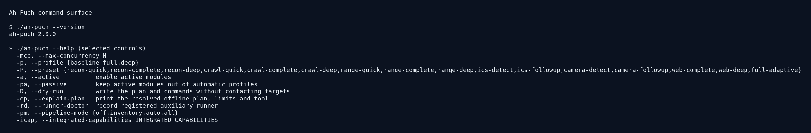
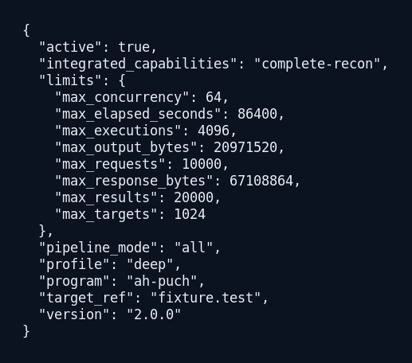
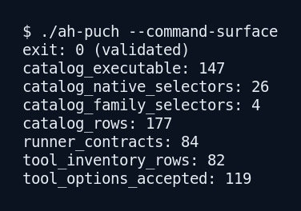
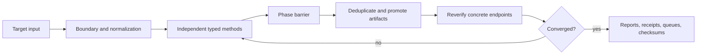

# Ah Puch


Ah Puch is a modular target-assessment runtime for private, owner-controlled
security work. It
accepts one domain, HTTP(S) URL, IP address, explicit `host:port`, CIDR range,
or target file, then coordinates discovery, verification, analysis, optional
active assessment, enrichment, and reporting through one bounded evidence
pipeline.

The runtime is designed for a private operator repository. It runs normally
from target input alone: it does not request a username, password, API key, or
interactive authorization prompt. Optional providers and credential checks are
explicit features, not prerequisites for the normal workflow.

## Highlights

- 147 executable catalog modules, 26 native selectors, 4 family selectors,
  and 177 catalog rows exposed by the live command surface.
- 82 independently described external or native method contracts and 122
  tool-option rows, with validation before execution.
- One automatic target boundary for domains, URLs, IPv4/IPv6 addresses,
  `host:port` values, CIDR ranges, and target files.
- Typed artifact promotion for hosts, addresses, services, origins, URLs,
  paths, parameters, technologies, fingerprints, devices, findings, and
  provider observations.
- Bounded parallel execution with phase barriers, convergence rounds,
  checkpoints, resumable queues, receipts, and SHA-256 integrity manifests.
- Local, offline, fixture-backed validation paths for reports, advisories,
  knowledge metadata, dictionaries, device data, and saved runs.
- Optional API enrichment that degrades honestly when a provider variable is
  absent; local discovery and analysis continue.

## Quick start

```sh
git clone <private-repository-url> ah-puch
cd ah-puch

# Small local installation.
./install.sh --minimal

# Prepare the complete local runtime and every available external method.
./install.sh --all-tools

./ah-puch --version
./ah-puch --help
```

Accepted target forms:

```text
example.com
https://example.com/application
192.0.2.10
2001:db8::10
192.0.2.10:8443
192.0.2.0/28
--targets-file targets.txt
```

The examples use documentation addresses or placeholders. In a private
installation, the operator supplies the target and chooses the desired mode;
the application does not add an authorization gate or ask for approval.

## Installation

`install.sh` is the supported bootstrap entry point. It creates an isolated
Python environment when possible, prepares private data directories, verifies
resource manifests, installs or checks external runners, and creates a local
`ah-puch` command link. It never edits shell startup files.

```sh
./install.sh --minimal       # Python runtime and bundled local resources
./install.sh --full          # runtime plus available native/external tools
./install.sh --all-tools     # every frozen recipe and readiness contract
./install.sh --doctor-only   # targetless inspection; installs nothing
./install.sh --no-tools      # skip system and Go-based tool installation
./install.sh --api-prompt    # explicitly opt in to provider-key setup
```

On Debian-family systems, `--minimal` first uses an existing Python virtual
environment and only attempts a non-interactive bootstrap of `python3-venv`,
pip, and the small packaging base if that environment cannot be created. Use
`--no-tools` only when those host prerequisites are managed separately.

`--full` and `--all-tools` report a degraded installation with a non-zero
status when a requested dependency cannot be installed or fails its identity,
version, or help contract. The launcher is not allowed to claim full readiness
when a required preparation step failed. A target run never installs software,
downloads wordlists, pulls container images, or changes the host toolchain.

The normal data root is:

```text
${AH_PUCH_DATA_DIR:-${XDG_DATA_HOME:-$HOME/.local/share}/ah-puch}
```

The installer stores private configuration and run data there, creates an
`activate.sh` helper, and places a command link in
`${AH_PUCH_BIN_DIR:-$HOME/.local/bin}`. Provider values are saved only when
`--api-prompt` is explicitly selected. The private file is mode `0600`; secret
values are never placed in Git, command arguments, receipts, or reports.

Runtime requirements are Python 3.10 or newer and the packages listed in
`requirements.txt`. External tools are optional at runtime and are admitted
only after their local contract has passed. The native ZAP Automation Framework
path is used when a local container runtime is unavailable.

## Operating profiles

```text
baseline   passive inventory and low-impact observation
full       complete modular analysis with enabled active stages
deep       broadest applicable coverage and extended bounded budgets
```

Named presets are available for reconnaissance, crawling, range discovery,
industrial protocols, camera surfaces, web analysis, and full adaptive runs:

```text
recon-quick       recon-complete       recon-deep
crawl-quick       crawl-complete       crawl-deep
range-quick       range-complete       range-deep
ics-detect        ics-followup
camera-detect     camera-followup
web-complete      web-deep
full-adaptive
```

`--passive` excludes active methods from automatic profiles. `--active` admits
active stages that are applicable to the validated target. `--dry-run` and
`--explain-plan` resolve the exact plan without opening a target connection.

## Interactive menu

Running `ah-puch` without a target opens the same runtime used by the CLI. The
menu exposes:

```text
01 Full analysis
02 Reconnaissance and asset discovery
03 DNS and infrastructure
04 HTTP and TLS
05 Website crawling
06 Content and directories
07 Endpoints and APIs
08 Secrets and JavaScript
09 Network, range, and industrial protocols
10 Web analysis
11 Threat intelligence
12 CVE and version intelligence
13 Camera and video-device surfaces
14 Saved-run analysis and queue rebuild
15 Dictionary inventory and builders
16 Tool and orchestration catalog
17 Preset runs by depth
18 Saved configurations
19 Advanced configuration
20 Help and flags
21 Native orchestration adapters
22 Typed recon pipeline
00 Exit
```

The menu, direct module selection, integrated capability selection, and
command-line flags all resolve the same catalog, scope boundary, option
validation, artifact bus, and terminal-state rules.

## Captured examples

These images were generated from the current executable using targetless
`--help`, `--explain-plan`, and command-surface checks. They do not contain
target data or provider credentials.







## Capability map

### Boundary and target normalization

- Normalizes domains, URLs, IPv4/IPv6 addresses, `host:port`, CIDRs, and UTF-8
  target files.
- Preserves a URL path and query as an initial seed while routing discovery by
  its validated origin.
- Re-checks every concrete endpoint before contact.
- Keeps redirects, certificate names, PTR names, provider data, and discovered
  services as attributable evidence without silently expanding scope.
- Creates independent timestamped workspaces for target-file entries.

### Discovery, DNS, and infrastructure

- Passive and active subdomain discovery with `subfinder`, `assetfinder`,
  `amass`, `findomain`, Chaos, certificate-transparency sources, `ctfr`, and
  built-in normalization.
- DNS record collection and resolution with `dig`, `dnsx`, `puredns`,
  `shuffledns`, `massdns`, `dnsrecon`, `dnsenum`, and `dnsmap` where available.
- Permutation and hostname expansion with `altdns`, `knockpy`, and `dnstwist`
  under explicit host and result limits.
- HTTP service validation with `curl`, `wget`, `httpx`, and native response
  parsing.
- Port and service validation with `nmap`, `naabu`, and `masscan`, including
  bounded TCP/UDP profiles, service/version metadata, and protocol follow-up.
- PTR feedback, certificate SAN collection, CDN/fronting origin candidates,
  and observed-service routing remain target-bound.

### HTTP, TLS, and application surface

- Headers, status, redirects, cookies, title, server hints, HTTP versions,
  TLS certificates, cipher posture, and security-policy observations.
- Technology and WAF fingerprinting with `whatweb`, `wafw00f`, native parsers,
  `sslscan`, `openssl`, and `testssl.sh`.
- Passive response evidence through ZAP baseline and an explicitly enabled
  active ZAP full profile.
- Web-server assessment with `nikto`, `wapiti`, and normalized web-audit
  evidence.
- Parameterized endpoint checks through bounded `sqlmap`, `dalfox`, `ssrfmap`,
  native differential NoSQL analysis, and explicit validation gates.

### Crawling and content discovery

- Primary bounded crawling with `katana`.
- Secondary source and endpoint collection with `gospider`.
- `hakrawler`, Playwright, native HTML/JavaScript parsing, and saved-capture
  adapters provide additional coverage when their contracts are available.
- Directory and file discovery with `dirsearch`, `gobuster`, `ffuf`, and
  recursive `feroxbuster`.
- `linkfinder`, `secretfinder`, JavaScript file analysis, source-map parsing,
  hidden-parameter discovery, `arjun`, `paramspider`, and API-schema analysis.
- Wordlist routing is typed: directory dictionaries, parameter names, DNS
  names, credentials, and payload patterns cannot be silently mixed.

### API, schema, and intelligence analysis

- OpenAPI/Swagger, GraphQL, Postman, JavaScript, source-map, URL, and parameter
  evidence are normalized into reusable records.
- Local CVE/advisory indexing maps observed products and versions without
  executing proof-of-concept code.
- The knowledge corpus is indexed locally by path, size, hash, identifier,
  reference, and provenance metadata.
- Optional provider adapters cover Shodan, Censys, Chaos, GreyNoise,
  VirusTotal, Hunter, FOFA, Google, AbuseIPDB, OTX, IPQualityScore, IPinfo,
  SecurityTrails, GitHub, HIBP, Website Carbon, and SSL Labs.
- Provider absence is reported as `skipped`; it does not erase local evidence
  or fabricate a successful provider result.

### Device, camera, industrial, and SSH surfaces

- Camera and video-device discovery uses normalized fingerprints, model/vendor
  filters, HTTP/HTTPS evidence, RTSP/RTSPS observations, and resumable chunks.
- Industrial follow-up uses indicators from the accumulated evidence and
  bounded protocol/service probes; it does not invent an endpoint.
- SSH banner and host-key fingerprinting records modern and compatibility
  fingerprints without storing private keys.
- An optional credential audit becomes eligible only after an SSH service is
  observed on a concrete in-scope endpoint and the operator explicitly enables
  it with `--credential-audit`. Candidate files and attempt counts are bounded;
  password values are not written to evidence.
- Device and network operations do not install persistence or perform
  destructive device actions.

### Evidence, convergence, and reporting

Every producer writes normalized records with producer, version, target hash,
scope, status, and artifact references. The typed pipeline:



Independent methods in a block can run in parallel. The next block consumes
only terminal results from the previous block. The union of accepted
observations is deduplicated by typed identity and retains all producer
provenance. The cycle stops at a stable digest or the configured
`--recon-max-rounds` limit.

## Integrated capability runs

The integrated selectors expose complete, reusable workflows without creating
separate execution engines:

```text
complete-recon               all applicable discovery and evidence stages
complete-assessment          complete web and network assessment consumers
complete-web-evidence        origins, URLs, paths, files, banners, parameters
subdomain-infrastructure     subdomains, DNS, addresses, services, Nmap
range-http-verification      range paths and bounded HTTP verification
industrial-protocol-followup indicators and protocol follow-up
device-inventory             fingerprints, technology, ports, resume state
ssh-credential-audit         explicitly enabled SSH candidate audit
dictionary-corpus            micro/short/long/all local corpus builder
advisory-correlation         offline advisory import and version matching
knowledge-index              offline Markdown metadata indexing
intelligence-catalog         provider and local intelligence aggregation
```

Example complete plans:

```sh
# Resolve a full deep plan and write no network traffic.
./ah-puch fixture.test --profile deep --pipeline-mode all \
  --integrated-capabilities complete-recon --dry-run --explain-plan

# Full target run after reviewing the plan.
./ah-puch example.com --profile deep --pipeline-mode all \
  --integrated-capabilities complete-recon --active --run full \
  --output ./private-results

# Complete web evidence with explicit bounded parallelism.
./ah-puch https://example.com --integrated-capabilities complete-web-evidence \
  --active --pipeline-workers 4 --integrated-workers 4 \
  --max-concurrency 8 --max-requests 2000
```

The first command is offline. The other commands are examples for an
operator-controlled target and may contact the target according to the
selected profile.

## CLI controls

The live `--help` output is authoritative. The main control groups are:

```text
Target and storage
  --target, --targets-file, --output
  --saved-run, --saved-operation, --verify-run, --rebuild-run
  --export-run, --export-output, --compare-run

Planning and selection
  --profile, --preset, --run, --modules, --surface-limit
  --module-option, --tool-option, --dry-run, --explain-plan
  --command-surface, --command-surface-output, --info, --catalog-browser

Execution policy
  --active, --passive, --no-core, --no-modules, --no-camera-analysis
  --follow-up, --follow-up-rounds, --all-tools
  --pipeline-mode, --phase-barrier, --continue-on-partial
  --stop-on-partial, --pipeline-workers, --pipeline-input-limit

Resource budgets
  --max-targets, --max-requests, --max-results
  --max-response-bytes, --max-output-bytes, --max-executions
  --max-concurrency, --max-elapsed-seconds
  --module-timeout, --core-timeout, --consumer-timeout
  --threads, --workers, --max-inputs, --rate-limit

Web and dictionaries
  --depth, --max-pages, --max-scripts, --max-params, --max-hosts
  --http-inventory-limit, --web-fanout-limit, --http-reverify-limit
  --no-web-fanout, --wordlist-tier, --no-dictionaries
  --build-dictionary, --dictionary-source, --dictionary-tier
  --http-verifier, --no-advanced-consumers

Range, device, and industrial workflows
  --range-mode, --range-custom-ports, --range-udp-ports
  --range-ports, --range-rate, --range-host-limit
  --device-port-profile, --device-custom-ports, --device-model
  --device-vendor, --device-resume, --device-workers
  --device-connect-timeout, --device-session-timeout, --device-retries
  --device-data, --import-device-data, --device-data-output
  --ics-max-urls, --ics-max-followups, --ics-timeout

Integrated adapters and evidence
  --integrated-capabilities, --integrated-workers
  --integrated-http-workers, --integrated-probe-workers
  --range-paths, --knowledge-source, --advisory-source
  --import-advisories, --advisory-store, --index-advisory-corpus
  --capture-adapter, --capture-input, --capture-output

Optional credential operations
  --credential-audit, --ssh-audit-users, --ssh-audit-passwords
  --ssh-audit-workers, --ssh-audit-max-attempts
  --auth-validate, --auth-service, --auth-username, --auth-password-env
```

Module overrides use `KEY=VALUE` globally or `MODULE_ID.KEY=VALUE` for one
catalog module. Tool overrides use `TOOL.KEY=VALUE` and are projected into the
actual external command vector after validation:

```sh
./ah-puch example.com --active --wordlist-tier short \
  --tool-option dirsearch.extensions=php,html,json \
  --tool-option dirsearch.recursive=1 \
  --tool-option ffuf.rate=25 \
  --tool-option gobuster.status_codes=200,204,301,302 \
  --tool-option feroxbuster.depth=2
```

Unknown module IDs, unknown keys, and options not owned by the selected tool
are rejected before execution. Worker counts and subprocess budgets are
clamped by the same invocation-wide limits across every adapter.

## External tool coverage

The tool inventory and runner registry describe availability separately from
integration. A method is dispatchable only after its binary identity, version,
help output, and option contract pass locally. Missing tools produce explicit
`skipped` results; they are never represented as successful findings.

The integrated inventory includes the following principal runners:

```text
amass, assetfinder, findomain, subfinder, chaos
ctfr, dnsx, puredns, shuffledns, massdns
dnsrecon, dnsenum, dnsmap, dig, altdns, knockpy, dnstwist
naabu, nmap, masscan
curl, wget, httpx, whatweb, wafw00f
sslscan, openssl, testssl.sh
gau, waybackurls, waymore
katana, gospider, hakrawler, Playwright
dirsearch, ffuf, gobuster, feroxbuster
linkfinder, secretfinder, jsfscan, arjun, paramspider
nuclei, nikto, wapiti, Arachni-compatible web audit, sqlmap
dalfox, ssrfmap, subzy, gitleaks, trufflehog
gowitness, cloudunflare, Shodan, Censys, GreyNoise, VirusTotal
Hunter, FOFA, ZAP baseline, ZAP full
```

ZAP uses one of two verified local paths:

1. a locally prepared container image with pull disabled during execution; or
2. the native `zaproxy` Automation Framework package.

The native path is functional without Docker or Podman. Container client
availability is reported independently, so a missing socket permission does
not hide the native path or corrupt a run status. ZAP full is active only when
the operator selects `--zap-active` or an equivalent deep assessment plan.

Inspect the local contracts without a target:

```sh
./ah-puch --runner-doctor
./install.sh --doctor-only
```

## Optional provider variables

Provider variables are optional. The runtime uses them only for the provider
routes that declare them, and stores only their names/status in receipts.

| Variable | Provider route | Used for |
| --- | --- | --- |
| `VIRUSTOTAL_API_KEY` | native provider module | URL/domain/IP reputation lookup |
| `SHODAN_API_KEY` | native provider module | host/service intelligence |
| `GOOGLE_API_KEY` | native provider module | search-backed discovery |
| `CENSYS_API_ID` + `CENSYS_API_SECRET` | native provider module | certificate/host intelligence |
| `SSL_LABS_API_KEY` | TLS compatibility setting | accepted private setting; current public TLS endpoint is usable without sending it |
| `ABUSEIPDB_API_KEY` | native provider module | IP abuse context |
| `OTX_API_KEY` | native provider module | indicator context |
| `IPQUALITYSCORE_API_KEY` | native provider module | IP/domain risk context |
| `IPINFO_API_KEY` | native provider module | IP metadata |
| `SECURITYTRAILS_API_KEY` | native provider module | DNS/history context |
| `GITHUB_TOKEN` | native provider module | repository/code metadata |
| `HIBP_API_KEY` | native provider module | breach lookup |
| `WEBSITE_CARBON_API_KEY` | native provider module | page sustainability metadata |
| `CHAOS_KEY` | inventory adapter | passive subdomain intelligence |
| `GREYNOISE_API_KEY` | inventory adapter | IP classification |
| `VT_API_KEY` | `vt` CLI adapter | VirusTotal CLI enrichment |
| `HUNTER_API_KEY` | native inventory adapter | email/domain intelligence |
| `FOFA_EMAIL` + `FOFA_KEY` | native inventory adapter | FOFA asset intelligence |

The two VirusTotal variables intentionally serve different adapters. Missing
keys produce a structured `skipped` status. Provider HTTP errors produce a
structured `failed` or `partial` result with a redacted status code and never
write the secret value.

## Dictionaries and local resources

The resource broker selects only a compatible typed corpus for each consumer.
The bundled source tree contains category wordlists, normalized micro and
short web corpora, the complete long-corpus split archives, typed payloads,
SSH audit dictionaries, device metadata, advisory records, and a local
knowledge reference corpus.

Directory tiers are deterministic:

```text
micro   up to 500 normalized entries
short   up to 5000 normalized entries
long    every admitted local entry
all     all available compatible sources for an explicit builder operation
```

Use the builder without a target:

```sh
./ah-puch --build-dictionary ./private/web-short.txt \
  --dictionary-tier short --dictionary-source ./data/wordlists
```

Use a specific local directory corpus:

```sh
./ah-puch example.com --active --wordlist-tier long \
  --tool-option dirsearch.wordlist=/absolute/path/words.txt
```

Local sources must be regular UTF-8 files within the configured size limit.
The broker records entry count and SHA-256, rejects symlinks, and does not
reinterpret payload corpora as directory dictionaries. `--no-dictionaries`
disables dictionary-backed discovery while leaving crawling, HTTP verification,
passive discovery, and report generation available.

## Outputs, recovery, and saved runs

Each target receives a private `0700` run directory. A normal run can contain:

```text
00-doctor/                 01-discovery/              02-dns/
03-http/                   04-crawl/                  05-content/
06-endpoints/              07-analysis/               08-network/
09-ics/                    09-camera-surfaces/        10-intelligence/
10-range/                  11-consumers/              advanced-consumers/
inventory/                 queues/                    alerts/
receipts/                  run-index/                 runtime/
manifest.json              checkpoint.json             module_status.jsonl
checksums.sha256           storage_inventory.tsv
```

Receipts contain producer/version, target hash, scope, redacted arguments,
status, and artifact hashes. `runtime/budget.json` records the effective
invocation budgets. Interrupted work writes `runtime/recovery.json`; queue
state and checkpoints are atomic and sequenced.

Terminal states are explicit:

```text
success    completed normally
partial    usable evidence exists with incomplete enabled work
skipped    not applicable, unavailable, or intentionally disabled
planned    dry-run only
timeout    execution exceeded its bound
failed     hard execution failure
disabled   blocked by current policy
```

Process status codes are `0` for success, `3` for a usable partial run, and
`10` when hard failed or timed-out terminal work remains. Argument and
installation errors use their normal non-zero status.

Inspect or rebuild a saved run without network contact:

```sh
./ah-puch --verify-run ./private-results/example.com/<timestamp>
./ah-puch --saved-run ./private-results/example.com/<timestamp> \
  --saved-operation inventory
./ah-puch --saved-run ./private-results/example.com/<timestamp> \
  --saved-operation grep --saved-query wordpress
./ah-puch --rebuild-run ./private-results/example.com/<timestamp>
./ah-puch --export-run ./private-results/example.com/<timestamp> \
  --export-output ./private-results/example.com-run.tar.gz
```

Export first verifies the seal, rejects concurrent mutation, refuses to
overwrite the explicit destination, and emits a deterministic archive with a
SHA-256 sidecar.

## Offline capture and local data operations

Capture adapters are targetless and network-silent. They normalize bounded
local TXT/CSV/JSON inputs or index local resources:

```sh
./ah-puch --capture-adapter crawler --capture-input ./capture.txt
./ah-puch --capture-adapter cve-correlation \
  --capture-input ./findings.txt \
  --capture-output ./private/cve-evidence.json
./ah-puch --import-advisories ./advisories.json \
  --advisory-store ./private/advisory-store
./ah-puch --index-advisory-corpus ./advisories \
  --advisory-index-output ./private/advisory-index
./ah-puch --import-device-data ./device-data.json \
  --device-data-output ./private/devices.json
```

These operations do not start an external target scanner and do not execute
proof-of-concept code.

## Privacy and operator controls

- Scope is derived from the supplied target and cannot be widened by a
  redirect, certificate name, provider result, or discovered link.
- Active/intrusive consumers are opt-in by profile or flag and remain bounded
  by request, result, response, execution, concurrency, and elapsed-time caps.
- Normal runs do not pause for an authorization question or require an
  authorization manifest; the target input is the complete run boundary.
- Optional credential validation requires explicit flags and reads a named
  environment variable rather than accepting a password on the command line.
- API keys, passwords, and private audit inputs are excluded from receipts,
  reports, archives, and source control.
- ZAP, Nikto, Wapiti, Arachni, SQLMap, SSRF, XSS, NoSQL, and SSH credential
  paths are bounded and are never silently enabled by passive discovery.
- The application writes only inside its configured data/output roots during a
  run; it does not touch unrelated disks or reconfigure the host.

## Repository contents

The private publication contains only the runnable source, required manifests,
bundled data, installer, and README media:

```text
ah-puch                         launcher
install.sh                      installer and preparation entry point
pyproject.toml                  package metadata and console entry point
requirements.txt                runtime Python dependencies
engines/                        orchestration and runtime
vendor/ahpuch_modules/          catalog modules and provider adapters
config/                         catalog, limits, inventory, recipes, hashes
data/                           dictionaries, payloads, advisories, devices
                                and local reference resources
tools/install_readiness.py      all-tools readiness helper
assets/                         README screenshots and Ah Puch mark
README.md                       English publication documentation
```

Generated reports, caches, virtual environments, test suites, audit work
files, journals, API stores, build directories, and local run results are not
part of the publication tree.

## License and private use

This repository is intended for private operator use. Review the individual
licenses of every optional external tool and data source before redistribution.
Keep provider credentials, private dictionaries, target lists, and assessment
results outside Git.
